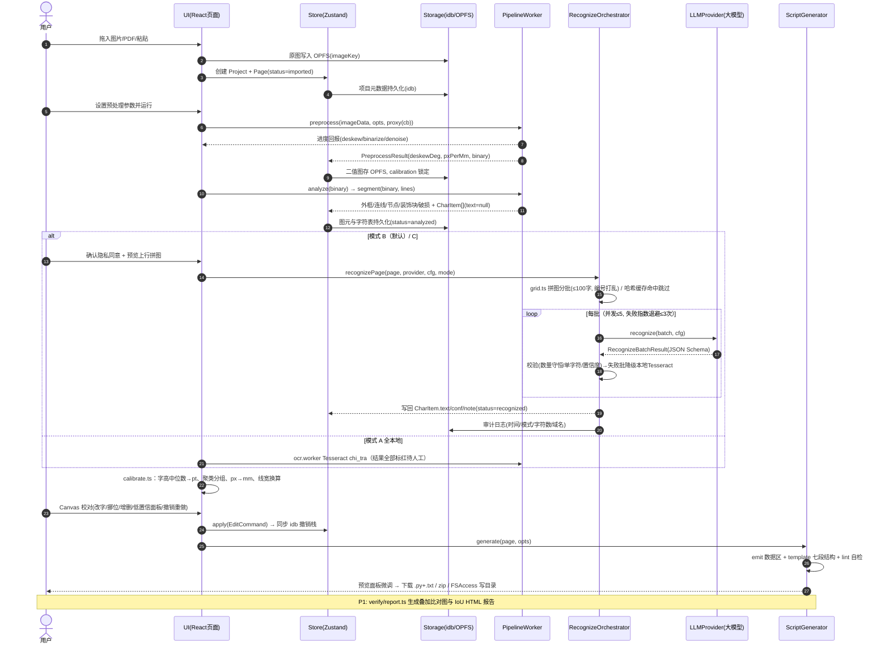
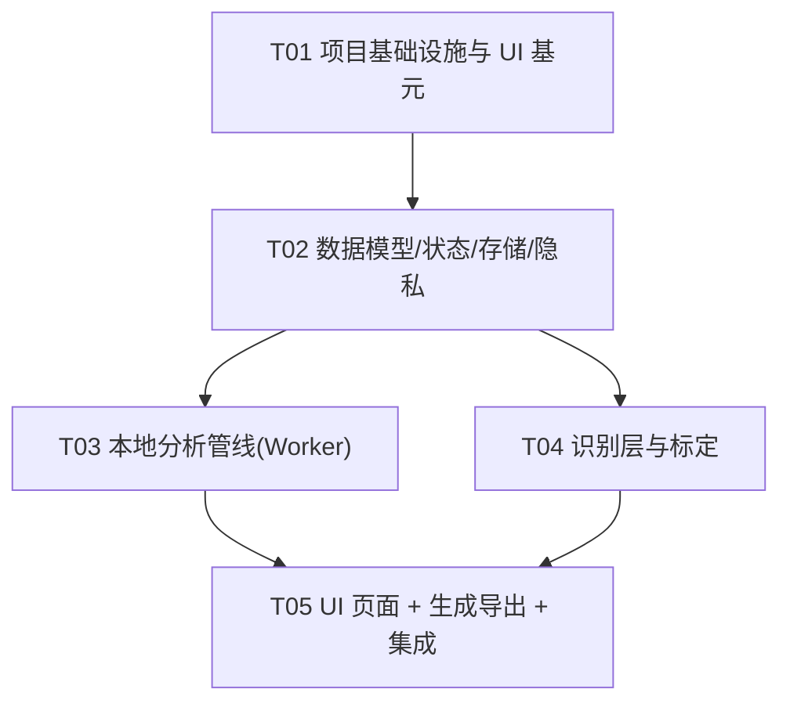

# ZupuScript Web — 系统架构设计文档

| 项 | 内容 |
| --- | --- |
| 版本 | v1.0（基于 PRD v2.0） |
| 作者 | 高见远（架构师） |
| 交付范围 | 一次性实现「可运行的完整 P0 闭环」+ P1 最小可用/接口预留 |
| 项目根目录 | `E:\2-AIprogram\1-Github-project\Zupu-edit\Zupu-edit1\` |

---

## 1. 实现方案与框架选型确认

### 1.1 核心技术挑战与对策

| 挑战 | 对策 |
| --- | --- |
| 浏览器内做图像处理（去斜/二值化/形态学/连通域） | **纯 JS + Canvas/Uint8Array 实现全部 P0 算法**（投影法去斜、Otsu/Sauvola、中值滤波、形态学开运算、连通域标记均为可手写的经典算法，单页 ≤8s 可达成）；OpenCV.js（`@techstark/opencv-js`）作为**可选增强懒加载**，仅在用户开启「高精度模式」时动态 import，首屏零阻塞 |
| 不阻塞 UI | 全部重计算放入 Web Worker，用 **Comlink** 包成类型安全的异步 API（避免手写 postMessage 协议），进度通过 `Comlink.proxy` 回调上报 |
| 大模型多厂商差异 + 浏览器直调 CORS | 统一 `LLMProvider` 接口；Gemini/OpenAI 直连；Anthropic 加 `anthropic-dangerous-direct-browser-access` 头；阿里百炼/智谱/DeepSeek/Ollama 统一走 **OpenAI 兼容端点**（custom provider + 预置 endpoint 模板）；CORS 不通时提示启用用户自填的可选代理 URL |
| 隐私硬约束 | 网络出网**只允许**发生在 `src/recognize/orchestrator.ts` 一处；三级模式 A/B/C，默认 B；密钥 Web Crypto AES-GCM 加密存 IndexedDB，支持「仅会话」 |
| Scribus 脚本可靠性（最高风险） | 生成器严格内建 PRD 第 10/11 章全部规则（`haveDoc()` 检查、`CLEAR_PAGE_FIRST`、三层字体解析、setFont 三次应用、文本框=字号 2 倍、getFont() 反查）；导出前前端语法自检 |
| 2000+ 字符画布流畅编辑 | Canvas 2D + 离屏画布缓存重建层；原图层与重建层分离；Zustand 仅存元数据不存位图 |

### 1.2 选型确认（与 PRD 第 12 章一致，两处收敛）

- **构建**：Vite 5 + TypeScript 5（strict）
- **UI**：React 18 + Zustand 5 + Tailwind 3 + shadcn/ui 风格基元（手写 6 个轻量基元，按需引 Radix）
- **Worker**：原生 `new Worker(new URL(...), {type:'module'})` + Comlink
- **图像**：纯 JS 算法为主 + `@techstark/opencv-js` 懒加载增强
- **PDF**：pdfjs-dist 4.x（ESM，worker 用 `?url` 引入）
- **存储**：idb（IndexedDB）+ OPFS（Safari 降级 idb Blob）+ File System Access（不支持时降级下载）
- **识别**：fetch 直调统一 Provider 抽象层 + Tesseract.js 5（chi_tra）本地兜底
- **打包/离线**：JSZip + vite-plugin-pwa（Workbox）
- **不引 react-router**：视图切换用 Zustand 状态驱动（页面少：项目列表/导入/分析/校对/导出），减少依赖
- **模板引擎**：原生模板字符串（PRD 允许），Python 脚本模板为带占位注释的常量 + 数据序列化函数

### 1.3 架构模式

分层单向依赖：`ui → store → 服务层(recognize/generator/storage/privacy) → model`；`workers` 通过 Comlink 被 store/服务层调用；`imaging/layout/segment/calibrate` 为纯函数库（可在 Worker 与主线程复用）。所有算法模块**无 React 依赖**，可独立测试。

---

## 2. 文件列表（共 66 个文件）

```
Zupu-edit1/
├── package.json                        # 依赖与脚本
├── vite.config.ts                      # Vite + PWA + worker 配置
├── tsconfig.json
├── tsconfig.node.json
├── tailwind.config.ts
├── postcss.config.js
├── index.html
├── public/
│   └── manifest.webmanifest            # PWA 清单
├── docs/
│   ├── PRD-v2.0.md                     # （已有）
│   ├── ARCHITECTURE.md                 # 本文档
│   ├── class-diagram.mermaid
│   └── sequence-diagram.mermaid
└── src/
    ├── main.tsx                        # 入口，挂载 App + 注册 SW
    ├── App.tsx                         # 顶层视图切换 + 全局对话框
    ├── index.css                       # Tailwind + CSS 变量（深/浅色）
    ├── vite-env.d.ts
    ├── lib/
    │   ├── constants.ts                # 全局常量（换算系数、阈值、批量大小、存储键名）
    │   └── utils.ts                    # cn()、ID 生成、格式化、防抖等
    ├── model/
    │   ├── types.ts                    # 全部核心类型（见第 3 章）
    │   └── zpproj.ts                   # .zpproj.json 序列化/反序列化/迁移
    ├── store/
    │   ├── projectStore.ts             # 项目/页面/图元/字符 状态与 CRUD
    │   ├── editorStore.ts              # 选中、视图变换、撤销重做命令栈
    │   └── settingsStore.ts            # 隐私模式、Provider 配置、预算、UI 偏好
    ├── storage/
    │   ├── db.ts                       # idb 封装：projects/pages/undoStacks/auditLogs
    │   ├── opfs.ts                     # 位图存取（OPFS，Safari 降级 idb Blob）
    │   └── fsaccess.ts                 # File System Access 读写 + 降级下载
    ├── privacy/
    │   ├── consent.ts                  # A/B/C 模式、首次同意、强制本地锁（URL 参数）
    │   ├── keystore.ts                 # API Key AES-GCM 加密存取/仅会话/销毁
    │   └── audit.ts                    # 隐私审计日志（时间/模式/字符数/域名）
    ├── workers/
    │   ├── pipeline.worker.ts          # Comlink expose：preprocess/analyze/segment
    │   └── ocr.worker.ts               # Tesseract.js 本地识别（隔离加载）
    ├── imaging/
    │   ├── raster.ts                   # ImageData↔灰度/二值矩阵、直方图、旋转画布
    │   ├── preprocess.ts               # 投影法去斜、Otsu/Sauvola、中值去噪、小连通域剔除、DPI 归一
    │   └── opencv.ts                   # OpenCV.js 懒加载封装（可选增强，接口与 preprocess 对齐）
    ├── layout/
    │   ├── detect.ts                   # 形态学开运算(横/纵核)→外框、横线、竖线检测
    │   └── nodes.ts                    # 环形窗口扫节点圆、装饰块(内部反色)、破损残留标记
    ├── segment/
    │   ├── segment.ts                  # 去线后连通域→字符包围盒+中心坐标（过分合并/拆分启发式）
    │   └── grid.ts                     # 编号打乱拼图构造（≤100 字/批，64×64 归一，PNG base64）
    ├── recognize/
    │   ├── types.ts                    # LLMProvider 接口、请求/结果类型
    │   ├── prompt.ts                   # 系统提示词（六条硬规则）+ JSON Schema + C 模式提示词
    │   ├── orchestrator.ts             # 分批/并发≤5/指数退避重试/校验降级链/成本估算/哈希缓存【唯一出网点】
    │   ├── providers/
    │   │   ├── gemini.ts               # Google Gemini（默认推荐，CORS 友好）
    │   │   ├── openai.ts               # OpenAI（含子密钥风险提示）
    │   │   ├── anthropic.ts            # Claude（特殊请求头）
    │   │   └── custom.ts               # OpenAI 兼容端点（百炼/智谱/DeepSeek/Ollama/自定义+可选代理）
    │   └── local/
    │       └── tesseract.ts            # chi_tra 兜底，结果全部标低置信
    ├── calibrate/
    │   └── calibrate.ts                # px→mm、字高→pt、字号聚类分组、线宽换算、人工覆盖
    ├── generator/
    │   ├── template.ts                 # Python 脚本模板（PRD 10.1 七段结构 + 第 11 章全部规避逻辑）
    │   ├── emit.ts                     # Page 数据 → BORDER_RECTS/TREE_LINES/... Python 字面量
    │   ├── lint.ts                     # 导出前自检（括号配对/引号转义/缩进/非法字符/数据条数守恒）
    │   ├── helpers.ts                  # 4 个辅助脚本（字体清单/字框轮廓开关/页面尺寸检查/批量导出）
    │   └── export.ts                   # 下载 / JSZip 打包 / FSAccess 直写目录
    ├── verify/
    │   ├── preview.ts                  # 按生成数据渲染重建位图（校对台右栏与质检共用）
    │   └── report.ts                   # 红/蓝/黑叠加比对 + IoU/命中率 + 单文件 HTML 报告（P1 最小实现）
    └── ui/
        ├── components/ui/              # shadcn 风格轻量基元
        │   ├── button.tsx
        │   ├── dialog.tsx
        │   ├── input.tsx
        │   ├── select.tsx
        │   ├── slider.tsx
        │   └── tabs.tsx
        ├── ProjectListPage.tsx         # 多项目列表（页数/完成度/占用空间/删除）
        ├── ImportPage.tsx              # 拖拽/点选/Ctrl+V/文件夹导入 + PDF 拆页（页码范围+DPI）
        ├── AnalyzePage.tsx             # 预处理参数（去斜滑块/二值化切换）+ 图元遮罩开关 + 运行管线
        ├── RecognizePanel.tsx          # 模式 A/B/C、Provider 选择、成本预估、上行拼图预览、进度
        ├── EditorPage.tsx              # 校对台：左右分栏联动 + 叠加模式 + 标定面板
        ├── ProofreadCanvas.tsx         # Canvas 渲染与全部编辑交互（改字/挪位/增删/框选/线段端点）
        ├── LowConfPanel.tsx            # 低置信列表，Tab 逐条跳转确认
        ├── ExportPage.tsx              # 脚本预览（高亮微调）+ 质检入口 + 导出（下载/zip/写目录）
        └── SettingsDialog.tsx          # 厂商/密钥/并发/预算/隐私模式/审计日志/一键清空
```

---

## 3. 数据结构与接口设计

> 图源文件见 `docs/class-diagram.mermaid`。以下为关键 TypeScript 定义（`src/model/types.ts` 与 `src/recognize/types.ts` 的契约）。

```mermaid
classDiagram
  class Project {
    +string id
    +string name
    +number createdAt
    +number updatedAt
    +string[] pageIds
  }
  class Page {
    +string id
    +number index
    +PageStatus status
    +SourceInfo source
    +Calibration calibration
    +FontSizes fontSizes
    +BorderRect[] borderRects
    +TagRect[] tagRects
    +TreeLine[] treeLines
    +TreeNode[] treeNodes
    +CharItem[] chars
    +ArtifactStroke[] artifacts
    +RecognitionMeta~?~ recognition
    +string imageKey
  }
  class CharItem {
    +string id
    +string|null text
    +number cx
    +number cy
    +[x1,y1,x2,y2] bbox
    +number pt
    +number conf
    +CharNote note
    +CharSource source
    +boolean edited
    +FontGroup group
    +CharKind kind
  }
  class BorderRect { +string id  +number x +number y +number w +number h }
  class TagRect { +string id  +number x +number y +number w +number h }
  class TreeLine { +string id  +number x1 +number y1 +number x2 +number y2 +number widthPx +Orientation orientation }
  class TreeNode { +string id  +number cx +number cy +number r +number strokePx }
  class ArtifactStroke { +string id  +number x1 +number y1 +number x2 +number y2 +number widthPx }
  class Calibration { +number pxPerMm  +[w,h] pageMm  +number deskewDeg }
  class FontSizes { +number body +number title +number pageno +number rank }

  class LLMProvider {
    <<interface>>
    +ProviderId id
    +string label
    +boolean needsKey
    +string defaultEndpoint
    +string defaultModel
    +recognize(req, cfg) Promise~RecognizeBatchResult~
    +estimateCost(charCount) number
  }
  class GeminiProvider
  class OpenAIProvider
  class AnthropicProvider
  class CustomProvider
  class LocalTesseractProvider

  class PipelineAPI {
    <<Comlink Worker>>
    +preprocess(img, opts, onProgress) PreprocessResult
    +analyze(bin, opts, onProgress) LayoutResult
    +segment(bin, lines, opts) CharItem[]
  }
  class RecognizeOrchestrator {
    +recognizePage(page, provider, cfg, mode, onProgress) CharItem[]
    -validateBatch(items, expect) 
    -downgradeToLocal(page) 
  }
  class ScriptGenerator {
    +generate(page, opts) GeneratedScript
    +lint(code) LintIssue[]
  }
  class EditorStore {
    +undoStack: EditCommand[]
    +redoStack: EditCommand[]
    +apply(cmd) / undo() / redo()
  }

  Project "1" --> "*" Page
  Page "1" --> "*" CharItem
  Page "1" --> "*" BorderRect
  Page "1" --> "*" TreeLine
  Page "1" --> "*" TreeNode
  Page "1" --> "*" TagRect
  Page "1" --> "*" ArtifactStroke
  Page "1" --> "1" Calibration
  Page "1" --> "1" FontSizes
  LLMProvider <|.. GeminiProvider
  LLMProvider <|.. OpenAIProvider
  LLMProvider <|.. AnthropicProvider
  LLMProvider <|.. CustomProvider
  LLMProvider <|.. LocalTesseractProvider
  RecognizeOrchestrator --> LLMProvider : 按 mode 调用
  RecognizeOrchestrator --> PipelineAPI : 取拼图/分割结果
  ScriptGenerator --> Page : 读取
  EditorStore --> Page : 命令修改 chars/图元
```



### 3.1 核心类型（`model/types.ts`）

```ts
export type PageStatus = 'imported' | 'preprocessed' | 'analyzed' | 'recognized' | 'proofread' | 'exported';
export type PrivacyMode = 'A' | 'B' | 'C';            // A 全本地 / B 拼图上云(默认) / C 整页上云
export type CharSource = 'llm' | 'local' | 'manual';
export type CharNote = 'ok' | 'blurry' | 'damaged' | 'multi' | 'empty';
export type FontGroup = 'body' | 'title' | 'pageno' | 'rank';
export type CharKind = 'text' | 'side';               // side = 书名/页码竖排字 → SIDE_CHARS

export interface CharItem {
  id: string;
  text: string | null;          // 只认不猜：看不清为 null
  cx: number; cy: number;       // 原图像素中心坐标（全局约定）
  bbox: [number, number, number, number];
  pt: number;                   // 标定后字号
  conf: number;                 // 0..1，<0.85 标红
  note: CharNote;
  source: CharSource;
  edited: boolean;
  group: FontGroup;
  kind: CharKind;
}
// BorderRect / TagRect / TreeLine / TreeNode / ArtifactStroke 字段同 classDiagram
export interface SourceInfo { name: string; page?: number; widthPx: number; heightPx: number; dpi: number; }
export interface Calibration { pxPerMm: number; pageMm: [number, number]; deskewDeg: number; }
export interface RecognitionMeta { mode: PrivacyMode; provider: ProviderId; model: string; batches: number; costEstimateCny: number; }
```

### 3.2 Provider 接口与识别协议（`recognize/types.ts`）

```ts
export type ProviderId = 'gemini' | 'openai' | 'anthropic' | 'custom' | 'local';

export interface ProviderConfig {
  provider: ProviderId;
  apiKey?: string;              // 来自 privacy/keystore，绝不进 .zpproj.json
  endpoint?: string;            // custom 必填；其余用默认
  proxyUrl?: string;            // 可选无状态 Edge 代理，默认空
  model: string;
  concurrency: number;          // ≤5
  timeoutMs: number;            // 默认 60000
  maxRetries: number;           // 默认 3，指数退避
}

export interface GridBatch {    // B 模式：一张拼图对应一批
  batchIndex: number;
  imageBase64Png: string;       // 10×10 编号网格，编号已打乱
  ids: number[];                // 打乱后格子编号 → CharItem.id 的映射由 grid.ts 返回
}
export interface RecognizeBatchRequest {
  mode: 'B' | 'C';
  batch?: GridBatch;            // B
  pageImageBase64?: string;     // C（整页 + 要求返回相对坐标）
  signal: AbortSignal;
}
export interface RecognizedItem { id: number; char: string | null; confidence: number; note?: CharNote; }
export interface RecognizeBatchResult {
  items: RecognizedItem[];      // 数量守恒：必须等于输入格数
  usage?: { promptTokens: number; completionTokens: number };
}
export interface LLMProvider { /* 见 classDiagram */ }
```

### 3.3 Worker API（Comlink，`workers/pipeline.worker.ts`）

```ts
export interface ProgressInfo { stage: 'deskew'|'binarize'|'denoise'|'layout'|'segment'; percent: number; }
export interface PreprocessOptions { targetDpi: number; binarizer: 'otsu'|'sauvola'; threshold?: number; manualDeskewDeg?: number; useOpenCV?: boolean; }
export interface PreprocessResult { width: number; height: number; deskewDeg: number; pxPerMm: number; binary: Uint8Array; /* 1bpp 打包 */ }
export interface LayoutResult { borderRects: BorderRect[]; tagRects: TagRect[]; treeLines: TreeLine[]; treeNodes: TreeNode[]; artifacts: ArtifactStroke[]; }

export interface PipelineAPI {
  preprocess(image: ImageData, opts: PreprocessOptions, onProgress: (p: ProgressInfo) => void): Promise<PreprocessResult>;
  analyze(binary: Uint8Array, width: number, height: number, onProgress: (p: ProgressInfo) => void): Promise<LayoutResult>;
  segment(binary: Uint8Array, width: number, height: number, lines: TreeLine[]): Promise<CharItem[]>;
}
// 主线程：const api = Comlink.wrap<PipelineAPI>(new Worker(new URL('./pipeline.worker.ts', import.meta.url), { type: 'module' }));
// onProgress 用 Comlink.proxy(cb) 传入。Uint8Array 走 Transferable。
```

### 3.4 编辑命令（撤销重做，`store/editorStore.ts`）

```ts
export type EditCommand =
  | { type: 'char.update'; charId: string; before: Partial<CharItem>; after: Partial<CharItem> }
  | { type: 'char.add' | 'char.remove'; char: CharItem }
  | { type: 'char.batchMove'; ids: string[]; dx: number; dy: number }
  | { type: 'char.batchResize'; ids: string[]; pt: number }
  | { type: 'line.update' | 'node.update' | 'rect.update'; id: string; before: unknown; after: unknown };
// 栈深 ≥100；每次变更同步写入 idb（undoStacks 表），刷新后恢复。
```

### 3.5 `.zpproj.json`

与 PRD 第 13 章完全一致（`version: "2.0"`，不含原图与密钥）。`model/zpproj.ts` 负责 `exportProject(projectId): string` / `importProject(json): Project`（含版本校验与字段默认值补齐）。

---

## 4. 程序调用流程

> 图源文件见 `docs/sequence-diagram.mermaid`。



---

## 5. 待明确事项（假设已注明）

1. **OpenCV.js 具体使用范围**：P0 全部算法用纯 JS 实现即可达标，OpenCV.js 仅作「高精度模式」开关。假设：一次性交付中 `opencv.ts` 提供懒加载骨架 + 去斜/形态学两个增强实现，未加载时自动回退纯 JS。
2. **shadcn/ui 引入方式**：不跑 CLI，手写 6 个基元（button/dialog/input/select/slider/tabs），样式遵循 shadcn 约定（CSS 变量），减少初始复杂度。
3. **C 模式坐标匹配**：PRD 要求模型返回相对坐标与本地分割匹配校验。假设实现为：按中心点最近邻匹配（阈值 0.5 字宽），匹配不上以本地分割为准、文字采用模型结果并标 `edited=false, conf` 降权。
4. **双模型交叉验证（F4.7）与批处理队列（F11.x）**：P1。本次交付预留 `orchestrator.crossValidate()` 接口与 `settingsStore.batchQueue` 类型，UI 仅做连续多页顺序处理的极简实现。
5. **ONNX Runtime Web**：不引入，本地兜底仅 Tesseract.js（chi_tra），减少 WASM 体积。
6. **国际化**：界面文案集中在 `lib/constants.ts` 附近的字面量中，暂不做 i18n 框架，仅简体中文版面（PRD 允许预留）。
7. **阿里百炼/智谱/DeepSeek**：不做独立 provider 文件，在 `custom.ts` 中预置 endpoint 模板（OpenAI 兼容），设置界面下拉选择。

---

## 6. 依赖包列表（package.json）

```jsonc
// dependencies
- react@^18.3.1 / react-dom@^18.3.1        # UI 框架
- zustand@^5.0.2                            # 状态管理
- comlink@^4.4.2                            # Worker RPC
- idb@^8.0.0                                # IndexedDB 封装
- pdfjs-dist@^4.7.76                        # PDF 拆页渲染（ESM，锁定 4.x）
- tesseract.js@^5.1.1                       # 本地 OCR 兜底（chi_tra）
- jszip@^3.10.1                             # zip 打包导出
- clsx@^2.1.1 / tailwind-merge@^2.5.4 / class-variance-authority@^0.7.0  # shadcn 基元依赖
- lucide-react@^0.454.0                     # 图标
- @radix-ui/react-dialog@^1.1.2             # dialog 基元底层
- @radix-ui/react-slider@^1.2.1             # slider 基元底层
- @radix-ui/react-tabs@^1.1.1               # tabs 基元底层
- @radix-ui/react-label@^2.1.0              # 表单标签
- @techstark/opencv-js@^4.10.0-release.1    # OpenCV.js（动态 import 懒加载，可选增强）

// devDependencies
- vite@^5.4.10                              # 构建（5.x 对 worker/WASM 生态最稳）
- @vitejs/plugin-react@^4.3.3
- typescript@^5.6.3
- tailwindcss@^3.4.14 / postcss@^8.4.47 / autoprefixer@^10.4.20
- tailwindcss-animate@^1.0.7                # shadcn 动画约定
- vite-plugin-pwa@^0.20.5                   # Workbox PWA
- @types/react@^18.3.12 / @types/react-dom@^18.3.1
```

版本兼容注意：pdfjs-dist 4.x 要求 `Promise.withResolvers`（Chrome 119+，符合 PRD 浏览器底线）；zustand v5 需 React 18（满足）；不使用 vite 6 以避开 vite-plugin-pwa 兼容窗口。

---

## 7. 任务列表（有序，按依赖排列）

| Task ID | 任务名 | 涉及文件 | 依赖 | 优先级 |
| --- | --- | --- | --- | --- |
| **T01** | 项目基础设施与 UI 基元 | `package.json`、`vite.config.ts`、`tsconfig.json`、`tsconfig.node.json`、`tailwind.config.ts`、`postcss.config.js`、`index.html`、`public/manifest.webmanifest`、`src/main.tsx`、`src/App.tsx`、`src/index.css`、`src/vite-env.d.ts`、`src/lib/constants.ts`、`src/lib/utils.ts`、`src/ui/components/ui/*`（6 个） | — | P0 |
| **T02** | 数据模型、状态管理与本地存储/隐私层 | `src/model/types.ts`、`src/model/zpproj.ts`、`src/store/projectStore.ts`、`src/store/editorStore.ts`、`src/store/settingsStore.ts`、`src/storage/db.ts`、`src/storage/opfs.ts`、`src/storage/fsaccess.ts`、`src/privacy/consent.ts`、`src/privacy/keystore.ts`、`src/privacy/audit.ts` | T01 | P0 |
| **T03** | 本地分析管线（Worker + 预处理/版面/分割） | `src/workers/pipeline.worker.ts`、`src/imaging/raster.ts`、`src/imaging/preprocess.ts`、`src/imaging/opencv.ts`、`src/layout/detect.ts`、`src/layout/nodes.ts`、`src/segment/segment.ts`、`src/segment/grid.ts` | T02 | P0 |
| **T04** | 识别层（Provider 抽象 + 编排 + 本地兜底）与标定 | `src/recognize/types.ts`、`src/recognize/prompt.ts`、`src/recognize/orchestrator.ts`、`src/recognize/providers/gemini.ts`、`src/recognize/providers/openai.ts`、`src/recognize/providers/anthropic.ts`、`src/recognize/providers/custom.ts`、`src/recognize/local/tesseract.ts`、`src/workers/ocr.worker.ts`、`src/calibrate/calibrate.ts` | T02 | P0 |
| **T05** | UI 页面、校对台、脚本生成/导出/质检与整体集成 | `src/ui/ProjectListPage.tsx`、`src/ui/ImportPage.tsx`、`src/ui/AnalyzePage.tsx`、`src/ui/RecognizePanel.tsx`、`src/ui/EditorPage.tsx`、`src/ui/ProofreadCanvas.tsx`、`src/ui/LowConfPanel.tsx`、`src/ui/ExportPage.tsx`、`src/ui/SettingsDialog.tsx`、`src/generator/template.ts`、`src/generator/emit.ts`、`src/generator/lint.ts`、`src/generator/helpers.ts`、`src/generator/export.ts`、`src/verify/preview.ts`、`src/verify/report.ts`、`src/App.tsx`（接线修改） | T02, T03, T04 | P0（质检报告/批处理极简部分为 P1） |

> T03 与 T04 相互独立，可并行；T05 是集成收口。每个任务内的文件按同层内聚，工程师可按任务顺序整体实现。

---

## 8. 共享知识（跨文件硬约定）

```
【坐标系】一律使用原图像素坐标。字符/节点 = 中心坐标 (cx, cy)；矩形 = 左上 (x, y, w, h)；线段 = 两端点。
【换算锁定】PX_PER_MM 在预处理（DPI 归一）后写入 page.calibration 并锁定，全链路不得改；公式集中
  在 calibrate/calibrate.ts：PT_PER_MM = 2.834645669（= 1/0.352778）。
【文本框规则】脚本内 box_mm = size_pt * 0.352778 * 2.0，保持实测字号、放大框，绝不缩字号。
【置信度】默认阈值 0.85（lib/constants.ts: CONFIDENCE_THRESHOLD），低于即标红进 LowConfPanel。
【批量规则】每批 ≤100 字（GRID_BATCH_SIZE = 100），格子编号 0..n 打乱，单字缩到 64×64，黑白 PNG。
【提示词】六条硬规则（只认不猜/逐格独立/保留原字形/一格一字/禁止解释/数量守恒）只允许出现在
  recognize/prompt.ts，禁止在别处复制改写。
【出网唯一性】全应用唯一的网络出口是 recognize/orchestrator.ts（经 Provider）；禁止任何遥测/埋点/
  第三方脚本。隐私审计由 privacy/audit.ts 记录。
【密钥】API Key 只经 privacy/keystore.ts 存取（AES-GCM）；绝不写入 .zpproj.json、审计日志、URL。
【状态】Zustand store 不持有 ImageBitmap/Uint8Array 位图，只存元数据 + OPFS imageKey；位图即用即取即释放。
【ID】一律 crypto.randomUUID()。时间一律 number（epoch ms）。
【撤销】所有校对修改必须经 EditCommand 走 editorStore.apply()，禁止直接改 page 数据，保证撤销栈与
  idb 同步（栈深 ≥100，刷新可恢复）。
【降级链】大模型批次失败 ≤3 次重试 → 降级 Tesseract.js 且结果全部 conf=0 标红；单批失败不影响他批。
【生成脚本】UTF-8 无 BOM；七段结构（PRD 10.1）；含 haveDoc() 检查、CLEAR_PAGE_FIRST 清页、三层字体
  解析 + 名归一化、setFont 三次应用 + 异常收集、getFont() 反查弹窗；导出前必须过 generator/lint.ts。
【Worker】全部经 Comlink 调用，进度回调用 Comlink.proxy；大数组用 Transferable 转移所有权。
【文案】界面简体中文；Scribus 相关帮助文本使用 1.6.6 中文实际菜单名（如「查看」而非「视图」）。
```

---

## 9. 任务依赖图


